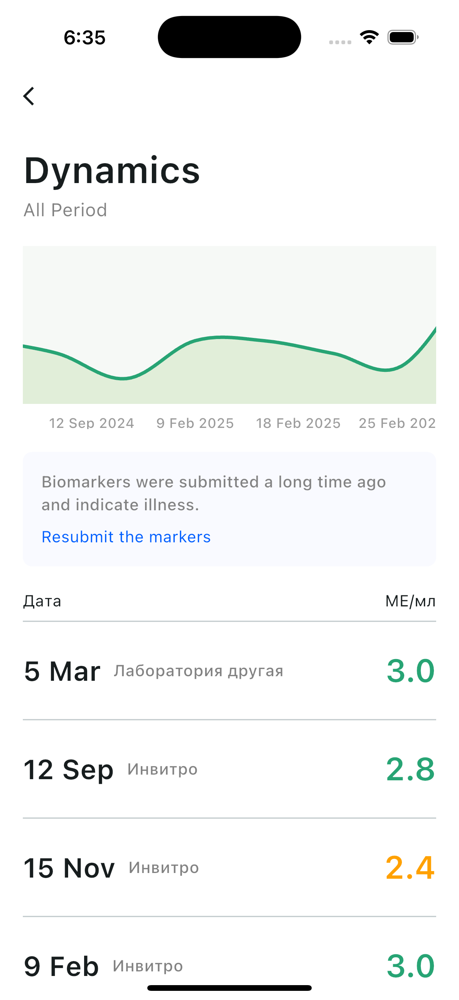

# YourHealth
## Test task for health tracking app

  
  
Stack: 
Network - Retrofit,
DI - Injectable,
Chart - fl_chart,
State Management - BLoC,

Build command: flutter pub run build_runner build --delete-conflicting-outputs
